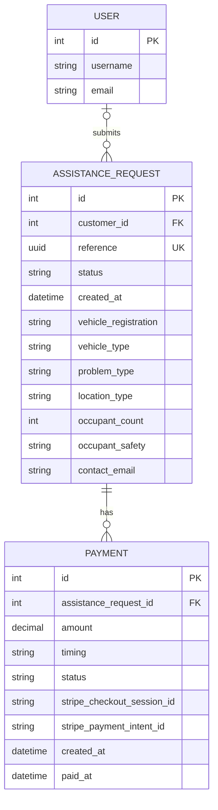

# Database Entity Relationship Diagram

```mermaid
erDiagram
    USER |o--o{ ASSISTANCE_REQUEST : submits
    ASSISTANCE_REQUEST ||--o{ PAYMENT : has

    USER {
        int id PK
        string username
        string email
    }

    ASSISTANCE_REQUEST {
        int id PK
        int customer_id FK
        uuid reference UK
        string status
        datetime created_at
        string vehicle_registration
        string vehicle_type
        string problem_type
        string location_type
        int occupant_count
        string occupant_safety
        string contact_email
    }

    PAYMENT {
        int id PK
        int assistance_request_id FK
        decimal amount
        string timing
        string status
        string stripe_checkout_session_id
        string stripe_payment_intent_id
        datetime created_at
        datetime paid_at
    }
```
